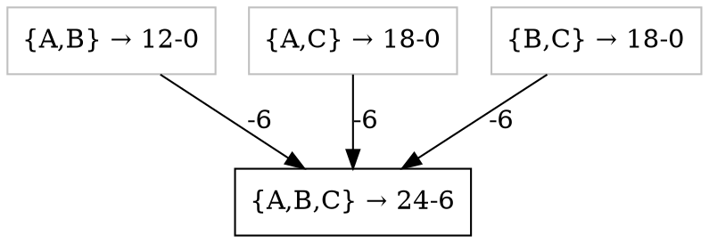
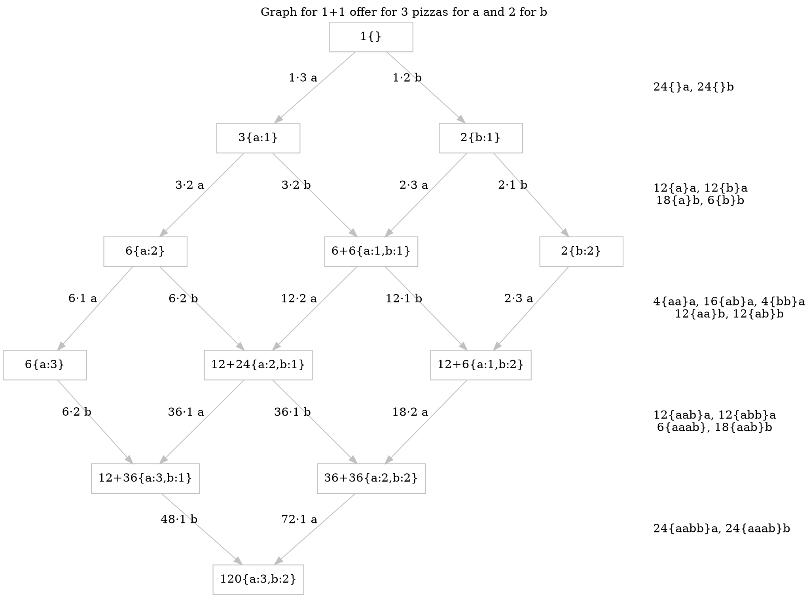

Pizza and 2+1 offers go together like
[Apache Airflow](https://airflow.apache.org/)
and data engineering: Nobody knows why, but it is a thing.

The premise is deceptively simple: Buy three pizzas and
get the cheapest one for free. (More like 3-1 if you ask
me, but I'm not a marketing guru.)

"Nothing complicated" you might think, and if you are a monster that can eat
three pizzas in one sitting (shout out to my past self) or a small family and
your pizza consumption patterns ends at three pizzas, you are mostly right.

But if you are one of my 2 regular readers (hi mum 👋), at this point
you probably suspect we will try to find problems where others seek
delicious satisfaction.

Let's start simple.

## Maximizing Savings

Faithful to the tradition of [spherical cow](https://en.wikipedia.org/wiki/Spherical_cow)
we will ignore delivery/packaging/… costs.
<!-- Not sure why everyone gives "spherical chicken in a vacuum"
to Big Bang theory, we had joke like that looong before that -->

Given group of people wanting to buy pizzas priced
$\pi = (p_1, p_2, p_3, \cdots, p_n) \in \mathbb{R}_+^n$, how to form groups of three
to maximize our savings with 2+1 offer? (We can always make things
divide evenly by three by filling with empty pizza $\varepsilon$ valued 0.)

<details>
<summary>
One can try brute force, but that is a no way to feed a
large crowd of hungry people who are not willing to
wait until you iterate through all the permutations/combinations/…
</summary>

```python
from itertools import islice, permutations
from random import choices
from typing import Number

pizza_prices = choices(range(1,10), k=10)

def savings(groups: list[list[Number]]) -> Number:
    return sum(min(g) for g in groups if len(g) == 3)

max_savings = 0
best_split = None

for l in permutations(pizza_prices):
    it = iter(l)
    groups = tuple(iter(lambda: tuple(islice(it, 3)),()))
    s = savings(groups)
    if s > max_savings:
        max_savings = s
        best_split = groups

print(f"{max_savings = }\n{best_split = }"
```
</details>

What a fun little coincidence that the solution here is a ~~glutenous~~
~~gluttonous~~ greedy algorithm.

```python
from decimal import Decimal
from fractions import Fraction
from itertools import batched
from typing import Generic, Iterable, Literal, Protocol, Sized, TypeVar

# Is there a better way to make mypy happy?
T = TypeVar("T", int, float, Decimal, Fraction, covariant=True)


class IterableSized(Generic[T], Iterable[T], Sized, Protocol): ...


def savings(groups: Iterable[IterableSized[T]]) -> T | Literal[0]:
    return sum(min(g) for g in groups if len(g) == 3)


def max_savings(prices: Iterable[T]) -> Iterable[tuple[T, ...]]:
    return batched(sorted(prices, reverse=True), 3)
```

You may feel tempted to copy-paste this into your "get-me-a-cheap-pizza.py",
but at the end of the day, I'm just a stranger on the Internet, and you
might not want to base your financial decisions on a random Python snippet.

To convince yourself that `max_savings` produces optimal
grouping as valuated by `saving`, you may employ the following
steps:

* Take a random permutation.
* Split it into groups of three + tail.
* Fill the tail (if there is one) with 0s to form a full group.
* Permutations within groups don't do anything to savings
  (because minimum always takes smallest regardless of it's position).
    * Reverse-sort elements within groups.
* Permutations of groups don't do anything to savings
  (because of associativity of sum).
    * Reverse-sort groups by the smallest (after sorting the last) element.
* Boundaries of groups.
    * Pick two neighbouring groups $(a,b,c)$, $(d,e,f)$.
        * Such that $d > c$.
        * We know $a \ge b \ge c, d \ge e \ge f, c \ge f$.
        * Thus by swapping elements c and d
            * savings can either improve
            * or stay the same.
        * Repeat from reverse-sorting within groups.
    * If there are no such groups, the elements are reverse-sorted.
* Thus: savings for any permutation would either stay the same or be
    improved by reverse-sorting the permutation.

And while some assembly is still required to turn that into a more solid
proof, I now imagine you checking up on nearby pizza providers to see which
ones offer 2+1.

<details>
<summary>
By the way, this approach can be generalized for any m+n scheme
for $m,n\in{}\mathbb{N}_+$.
</summary>

```python
from decimal import Decimal
from fractions import Fraction
from itertools import batched
from typing import Iterable, Literal, TypeVar

T = TypeVar("T", int, float, Decimal, Fraction, covariant=True)


def savings(groups: Iterable[Iterable[T]], m: int, n: int) -> T | Literal[0]:
    assert m > 0
    assert n > 0
    return sum(p for g in groups for p in sorted(g)[:-m][:n])


def max_savings(prices: Iterable[T], m: int, n: int) -> Iterable[tuple[T, ...]]:
    assert m > 0
    assert n > 0
    return batched(sorted(prices, reverse=True), m + n)
```

A proof can follow similar structure.

Can you generalize for m+n for $m,n \in \mathbb{R}_{+}$?
</details>

## Splitting the Savings

Armed with the way to maximize savings,
some entrepreneurially-spirited readers might already
be looking for more people to join them on the saving-on-pizza
(ad)venture. After all, even if I can/want to buy only one pizza,
there is nothing stopping me from finding more people to join-in
on the fun.

And here we hit another complication: how to split the savings?
Alternatively, how to do proper cost attribution? Imagine two
friends buying three pizzas to share (each arbitrarily split).
Or three individuals forming an alliance to get the exact pizza
they want for the best possible prize. Should we be doing
attribution per person or per pizza? Or perhaps some other
way? <span style="color: red">We need a way to evaluate them,
a criterion that would help us evaluate which split is the best.</span>

That is lots of questions and we'll talk about some of them.

### Any Split is Okay

First and foremost, any split that all the participants
agree on is "okay". Taking as an example two people
and total prize of pizza $P$, the $(0,P)$ split (one friend
foots the bill) is okay. Even $({-X},P+X)$ split for $X > 0$
is fine. Though in these cases there is usually some
other value flowing that is invisible to our pizza-and-money-focused
sight. (Friendship, being parent, or whatever reason
one might have to financially incentivize someone to have food with them.)

That said, here we will focus mainly on cases where participating
parties want to consume only specific amount of specific pizza(s)
and we'll assume non-existence of fridges 🤪. (Person who
wants 2 pizzas but orders 3 just to get the discount gets 0 ~~utility~~
enjoyment from the last pizza.)

Before proceeding any further let's introduce couple of handy shorthands.

$\Sigma{}\!\pi{}$, the total original price.

$$
\Sigma\!\pi = \sum \pi = \sum_{i=1}^{n} p_i
$$

$D(\pi)$, the optimal discount.

$P_{\!\!D}(\pi)$, the optimal price $\Sigma\!\pi - D(\pi)$.

And I will omit $\pi$ when convenient/obvious.

### Value-Proportional Split

<svg viewBox="0 0 210 70" fill="white">
  <style>
  text {
    font: 5px sans-serif;
    fill: black;
  }
  </style>
  <defs>
    <circle id="pep" fill="#c44" r="3.4" stroke="#c33" stroke-width="0.2" />
    <circle id="base" cx="0" cy="0" r="23.5" fill="#ca6" stroke="#975" stroke-width="3" id="circle1" />
    <path id="mush" d="m -2.9042573,0.7171111 c -0.314539,-1.198178 1.381813,-2.7544925 2.67750405,-2.8261196 C 1.1525137,-2.1852605 3.0495307,-1.0036881 2.9376727,0.5669068 0.45331975,0.0194738 0.45162175,0.028727 0.45162175,0.028727 l 0.276989,1.8900144 -1.562939,0.1937586 0.192051,-2.0911232 c 0,0 -1.75413005,0.5546362 -2.26198005,0.6957343 z" />
    <path id="pine" d="M -2 -2 L 2 -2 L 1.5 2 L -1 1.5 Z" fill="#ff0" />
    <g id="peps">
      <use href="#pep" x="-16"  y="3" />
      <use href="#pep" x="-15"  y="-5.5" />
      <use href="#pep" x="-10"  y="-13.5" />
      <use href="#pep" x="-1.5" y="-16.5" />
      <use href="#pep" x="7.5"  y="-14.5" />
      <use href="#pep" x="14"   y="-9" />
      <use href="#pep" x="16.5" y="-1" />
      <use href="#pep" x="15.5" y="7.5" />
      <use href="#pep" x="9.5"  y="13.5" />
      <use href="#pep" x="0"    y="16" />
      <use href="#pep" x="-10"  y="12" />
      <use href="#pep" x="-4.5" y="4.5" />
      <use href="#pep" x="-3.5" y="-6" />
      <use href="#pep" x="5.5"  y="-4" />
      <use href="#pep" x="6"    y="5.5" />
    </g>
    <g id="mushies" style="fill:#615139;fill-opacity:1;stroke-linecap:round;stroke-linejoin:round;paint-order:stroke fill markers">
      <use href="#mush" transform="translate(2 -10) rotate(43)" />
      <use href="#mush" transform="translate(-9 -1) rotate(-45)" />
      <use href="#mush" transform="translate(1 1) rotate(-139)" />
      <use href="#mush" transform="translate(11 2) rotate(100)" />
      <use href="#mush" transform="translate(-1 10) rotate(135)" />
    </g>
    <g id="pines">
      <use href="#pine" transform="translate(-5 -11.5) rotate(51)" />
      <use href="#pine" transform="translate(-9.5 -6) rotate(-5)" />
      <use href="#pine" transform="translate(-10 5) rotate(-139)" />
      <use href="#pine" transform="translate(11 -3.5) rotate(15)" />
      <use href="#pine" transform="translate(4 11.5) rotate(25)" />
    </g>
  </defs>
  <!-- Background -->
  <rect x="0" y="0" width="100%" height="100%" fill="#ffffff" id="rect1" />
  <g transform="translate(35 35)">
    <g id="pizza-1">
      <use href="#base" />
      <use href="#peps" />
      <use href="#mushies" />
      <use href="#pines" />
    </g>
    <use href="#pizza-1" />
    <path id="omg" transform="rotate(-45)" d="M 0 0 L 30 0 A 30 30 0 0 1 0 30 Z" />
    <clipPath id="clip1" clipPathUnits="userSpaceOnUse">
      <use href="#omg" />
    </clipPath>
    <use transform="translate(2 0)" clip-path="url(#clip1)" href="#pizza-1" />
  </g>
  <g transform="translate(105 35)">
    <g id="pizza-2">
      <use href="#base" />
      <use href="#peps" />
      <use href="#mushies" />
    </g>
    <use href="#pizza-2" />
    <path id="omg" transform="rotate(-45)" d="M 0 0 L 30 0 A 30 30 0 0 1 0 30 Z" />
    <clipPath id="clip1" clipPathUnits="userSpaceOnUse">
      <use href="#omg" />
    </clipPath>
    <use transform="translate(2 0)" clip-path="url(#clip1)" href="#pizza-2" />
  </g>
  <g transform="translate(175 35)">
    <g id="pizza-3">
      <use href="#base" />
      <use href="#peps" />
      <use href="#pines" />
    </g>
    <use href="#pizza-3" />
    <path id="omg" transform="rotate(-45)" d="M 0 0 L 30 0 A 30 30 0 0 1 0 30 Z" />
    <clipPath id="clip1" clipPathUnits="userSpaceOnUse">
      <use href="#omg" />
    </clipPath>
    <use transform="translate(2 0)" clip-path="url(#clip1)" href="#pizza-3" />
  </g>
</svg>

This split is based on the assumption that the value of each pizza
is proportional to it's original (pre-discount) price and
we will just uniformly scale the value of each pizza by
ratio $R = \frac{P_{\!\!D}}{\Sigma}$, so new prices are

$$
\pi{}' = R\cdot{}\pi = (R\cdot{}p_1, R\cdot{}p_2, \cdots{}, R\cdot{}p_n)
$$

With these new prices, people split pizza among themselves
and contribute proportionally to what they got of each pizza.

Instead of properties definitions, lemmas and proofs of
this split having or not having said properties, and fancy corollaries,
here's a bunch of examples to think about:

* Group bought all same-priced pizzas. After scaling all
  still cost the same. Makes sense.
* Two friends bought 3 pizzas and each friend had half of each pizza.
  Each one will pay half of $P_{\!\!D}$. Makes sense.
* Previous example generalized to 1 friend eating $x \in{} \left<0,1\right>$
  and the other eating $1-x$. Makes sense.
* Generalization to multiple participants is also sensible.
* If a participant ends up having no pizza, they pay 0. Makes sense.
* People with expensive taste pay more than people on the other
  side of the spectrum. Makes sense.
* Nobody pays more than they would have on their own. Makes sense.

Overall a very reasonable split, innit? Especially given
that it is easy and (computationally) cheap to calculate.

### Saving-Contribution-Proportional Split

So why would anyone ever be unhappy with the pizza-proportional split?

As an example take an individual $A$ who is eyeing a
[<abbr title="Generic Currency Sign">¤</abbr>](https://en.wikipedia.org/wiki/Currency_sign_\(generic\))6
pizza. $A$ usually buys pizza with $B$ and $C$, who also get ¤6 pizzas,
each paying ¤4. But what happens if $C$ develops
more expensive taste and decides to go for a pizza worth ¤12.
Suddenly, even though total group saving is still ¤6, $A$
needs to pay ¤4.5. Savings distribution (1.5,1.5,3)
is skewed towards the person with more expensive taste.

We might try to convince ourselves that this is compensated
by having bigger proportion of savings if someone decided
to go cheaper, but it is not the same: total savings
are unchanged, and $A$ still gets the same pizza, yet
saves less.

We might want to think about how much each individual contributes
to savings rather than total price of pizza. Let's
see how total pizza price develops with all possible group
formations.



Here we see that all contribute equally to the discount.
So equal split of ¤6 savings seems sensible, making contributions
(10,4,4).

How does this generalize to multiple participants? And to m+n
discount structure?

Things are going to get a bit hairy so let's scale down to
1+1 offer where we will be able to observe the thought
process yet won't get overwhelmed by scaling
challenges of naive approach on 3 participants.

Example: $A,B,C$ want to buy pizzas priced $\pi=(6,10,12)$ with **1+1** offer.
How much does each contribute to total savings $D_{\!\!P}$ of ¤10?

This case is less straightforward than the previous. How
much is contributed by whom is determined by order in which
they join. Here are all 6 possible permutations (pizza-party fromation orders):

```
A, B(-6),  C(-4) -- A alone has no discount,
                 -- when B joins they have discount 6
                 -- and when C joins they have discount 10
                 -- so C contributed only 4.
A, C(-6),  B(-4)
B, A(-6),  C(-4)
B, C(-10), A(0)
C, A(-6),  B(-4)
C, B(-10), A(0)
```

And now we average individual discount contributions across all the possibilities:

$$
\begin{align}
A_C =& {-(0+0+6+ 0+6+ 0)}/6 &= {-2} \\
B_C =& {-(6+4+0+ 0+4+10)}/6 &= {-4} \\
C_C =& {-(4+6+4+10+0+ 0)}/6 &= {-4} \\
\end{align}
$$

We just calculated everyone's average marginal
contribution across all possible coalitions,
and basically re-discovered [Shapley value](https://en.wikipedia.org/wiki/Shapley_value).
[Lloyd Stowell Shapley](https://www.lindau-nobel.org/lloyd-shapley-a-founding-giant-of-game-theory/)
was a rock star in certain circles.


By now you probably see the problem: Doing it by hand for more than
three participants can be something to keep oneself busy for a
duration of a flight where the only other thing fighting for
your attention is a screaming child and a flight attendant with
quite limited snack selection, but otherwise to be avoided.
(But so is [filling squares with numbers](https://www.brainbashers.com/showskyscrapers.asp).)


But it is great to notice that going over all the permutations
is very repetitive, as contribution of $A_n$ to any permutation
of $A_1, \cdots, A_{n-1}$ is the same. And things can be reduced
even further if we have multiple pizzas with the same price.

At this point you can visualize BFS-style discovery of a
lattice-shaped graph that has nodes for all sub-multi-sets, edges represent
adding a element, annotated with the element, count (how many ways we can
travel it from the root) and marginal contribution of that element for to the
source node.




[I know what you are thinking](https://tenor.com/4o1p.gif?always-sunny-charlie-conspiracy), but hear me out.

## End

That's all for now 🍕

I'd like to extnd this article with:

* Algorithm to calculate shapely value.
* Complexity
    * Good algo collapses to good complexity
      on degenerated inputs (all same prices, ...)
* A paragraphs or two on stability of coalitions
    * What motivates people to form this coaltion
      and to not kick out a person out of a coalition
      for a higher profit.
