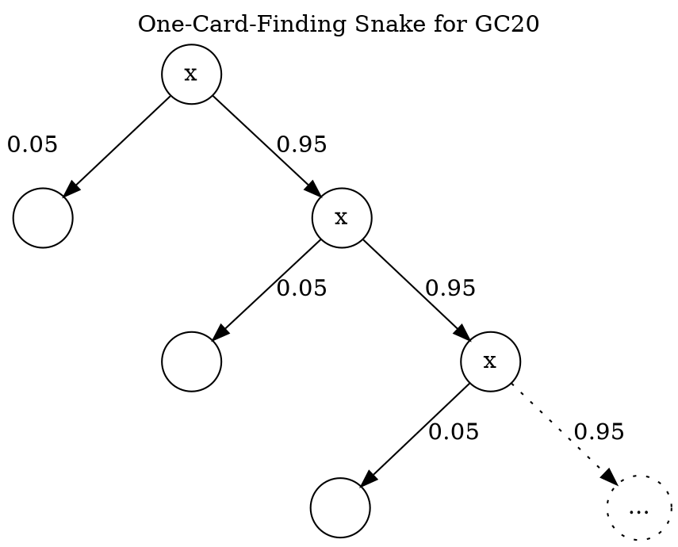
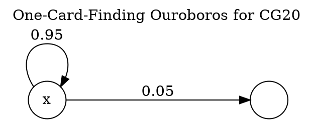
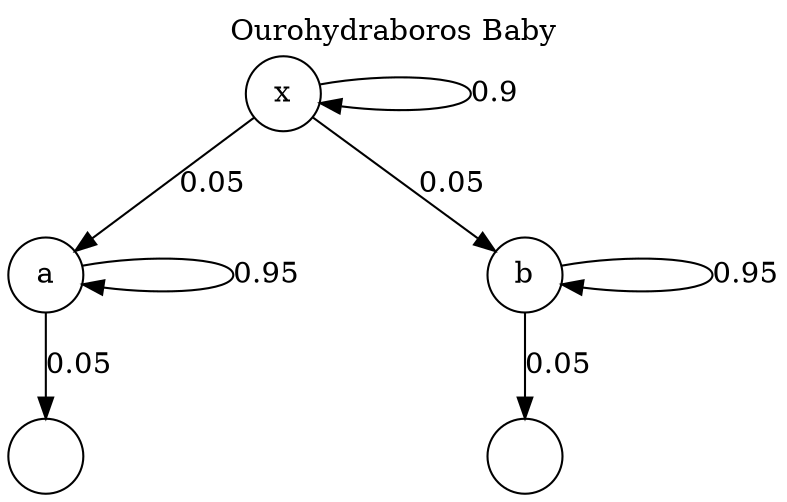
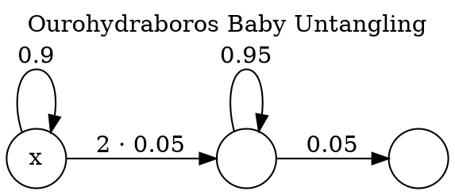
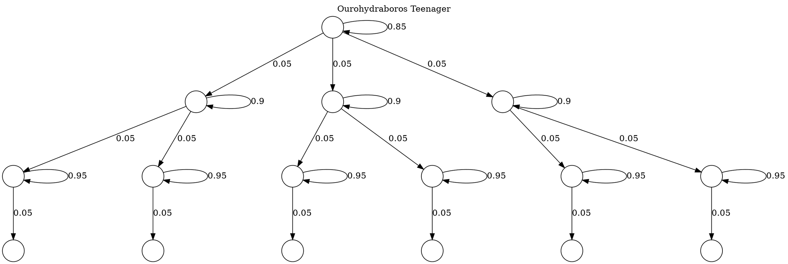
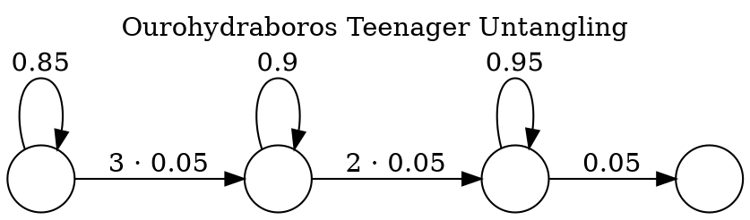
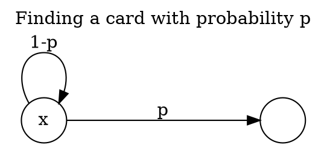

Unfinished; posting anyway.

<!--
Alternative titles:

* Pricing Scarcity
* Pricing Randomness
* Pricing (a?) Chance
* Pricing Fortune
* Pricing Probability

Creature:
Ourohydraboros
Ourohydra
Hydraboros
Ouroboros hydra
-->

As a kid I lived through several collecting manias in the midst of my
peers. Hockey cards, Kinder surprise toys, Pogs, Cs... Most of them
managed to mostly pass me. I had owned some, but I was never really into
the thing to the point of spending my own money on it. The only exception
were stickers that came with Resanka (filled croissant in package with a
drawing of a girl). Collecting a full set allower yout to enter a draw
for prizes or something. (I haven't managed to find more information about
it beyond stickers being numbered, there being about 16 or 20 different
ones, number one being "Kamoš Loptoš", and number sixteen "Hadica" (very
childish pun on snake female and a garden hose). I think I managed to
fill about three of the albums which shows how many I must have eaten. 😅)

Primary mechanism of acquiring these collectible items is buying an
opaque collection which contains a random selection of given size.
Common names are "Pack" or "Loot box" or similar. However, oftentimes
people start trading these cards, either for other cards,
or through established value-exchange media such as money (and so
[secondary markets](https://en.wikipedia.org/wiki/Secondary_market) emerge).

# CG20

We'll start with a very simple card collecting game CG20
(Collecting Game 20). It will be our playground to explore
some basic principles guiding the price of these cards.

CGA works as follows:

* There are 20 different cards.
* Cards are sold in individual packs (one card per pack).
* Pack costs ¤1.
* Cards have uniform probability. (So each card has the same probability
  to be found in each pack. For this particular setup that is
  probability that is sometimes expressed as 1/20, 0.05, 5%, or 1:19.)
* There is no limit on how many packs can be bought (so [scarcity](https://simple.wikipedia.org/wiki/Scarcity)
  is not a part of our problem in this game).

**Question #1**: How much should we expect to pay to get a specific card?

(Maybe that is the last one we need to get the dopamine
hit from completing our collection?)

As each pack costs ¤1 this is the same as asking what is the
expected number of packs to open to get a specific card.

* Probability of us getting it on the first try is 0.05.
* Getting it on the second try means we did not
  get it on the first try so that is 0.95 * 0.05.
* Getting it on the third try means we did not get it on
  the first try (0.95) and on the second try (0.95 or remaining
  probability) and got it on the third time: 0.95 * 0.95 * 0.05.
* And so on.

Now we make weighted average of that:

$$
\sum_{i \in \mathbb{N}^{+}} \frac{i\cdot{}19^{i-1}}{20^i} = 20
$$


<details>
<summary>
If you don't know how to get the value of
[geometric series](https://en.wikipedia.org/wiki/Geometric_series),
infinite sums might look a bit intimidating. However
we have [previously seen with generating functions](2026-02-25-tech-interview-aftertaste.html)
it is possible to turn the infinity to eat itself.
</summary>

$$
\begin{align}
x &= 1\cdot{}\frac{19^0}{20} + 2\cdot{}\frac{19^1}{20} + 3\cdot{}\frac{19^2}{20} + 4\cdot{}\frac{19^3}{20} + \cdots{} \\
\frac{19}{20}x &= 0\cdot{}\frac{19^0}{20^1} + 1\cdot{}\frac{19^1}{20^2} + 2\cdot{}\frac{19^2}{20^3} + 3\cdot{}\frac{19^3}{20^4} + \cdots{} \\
\frac{x}{20} &= 1\cdot{}\frac{19^0}{20^1} + 1\cdot{}\frac{19^1}{20^2} + 1\cdot{}\frac{19^2}{20^3} + 1\cdot{}\frac{19^3}{20^4} + \cdots{} \\
\frac{19x}{400} &= 0\cdot{}\frac{19^0}{20^1} + 1\cdot{}\frac{19^1}{20^2} + 1\cdot{}\frac{19^2}{20^3} + 1\cdot{}\frac{19^3}{20^4} + \cdots{} \\
\frac{20x - 19x}{400} &= \frac{1}{20} \\
x &= \frac{400}{20} = 20 \\
\end{align}
$$
</details>

So if we want a specific card and see an offer for less
than ¤20, it is better than buying individual packs.
And it works the other way too: we should not be willing to pay more than ¤20.

This gives us a bound on what a fair price of a card might be. As aspiring
finance bros we might be tempted to slap an order book on the problem, and we
might be right to let the market discover a fair price. But it is good to know
that if such a market goes above ¤20, it is time to sell... (Or maybe
something happened that we don't know about? 🤔)

On the other side it is obvious that if price goes under ¤1 it is time
to buy like there is no tomorrow. (Or not, could be a sign
of collapsing market 🤷.)

(Impatient reader likely already noticed that if we keep buying packs,
we will also accumulate cards we can try selling ourselves,
and that way offset our cost. Let's not think about that just yet.)

**Question #2**: How much should we expect to pay for two specific (different) cards?

Trying to make infinity eat itself will start soon
turn to ourohydraboros. Time for pictures!




Notice that the graph without the red part
is the same as the graph with it. We can turn that edge into a loop!
(Think of value at a node as an average length of path from that node
if we were taking random walks with probabilities as labelled.)



$$
\begin{align}
x &= 0.05 \cdot 1 + 0.95 * (1 + x) \\
x &= 0.05 + 0.95 + 0.95x \\
0.05x &= 1 \\
x &= 20 \\
\end{align}
$$

From there we can draw diagram for 2 cards



Let's merge duplicate parts.



$$
\begin{align}
x &= 0.1 (1+20) + 0.9 (1+x) \\
x &= 2.1 + 0.9 + 0.9x \\
0.1x &= 3 \\
x &= 30 \\
\end{align}
$$

With price per card now only 15 as opposed to 20 in case of a single card.
Here we see why a seller would offer discounts four buyers of several packs.

<details>
<summary>
One can go to three and beyond but size of the full diagram grows rather quickly...
</summary>




</details>

**Question #3**: What is expected of m different cards?

$$
\sum_{i=1}^{m} \frac{20}{i}
$$

<details>
<summary>
What is the expected price of a full collection?
</summary>

$$
\sum_{i=1}^{20}\frac{20}{i} \approx 71.95
$$

Giving us price per card about ¤7.2.
We could have discovered this also from the other side:
getting one card (any card) takes just one pack. To get a second (different)
one it is 20/19 (inverse of probability of finding a different card),
and once we have two, the next one is 20/18, and so on, until the
last card to complete our collection (as we found out earlier)
is 20/1.
</details>

# CGN

Let's bump the things a notch and make our game have N cards.
(This way we work with a family of games, one for each N.)

To translate previous results without going into details:

* Individual card's probability is $p = \frac{1}{N}$.
* Expected number of opened packs to find a given card is
  $$
    \sum_{i\in\mathbb{N^{+}}} \frac{i(N-1)^{i-1}}{N^i}
    = i p (1-p)^{i-1}
    = N
  $$
* Expected number of opened pack to find m different specific cards?
  $$
    \sum_{i=1}^{m}\frac{N}{i}
  $$

A more general question is asked by
[Coupon collector's problem](https://en.wikipedia.org/wiki/Coupon_collector%27s_problem):
what is the probability that more than x packs need
to be open to collect all N cards? (You can meet there
logarithms and Stirling numbers again!)

We ask similar question: What is the probability that more than
x packs need to be open to find a given card, and more specifically
what is the probability $P^{+}$ that we'll need to open more than
expected number of packs?

$$
P^{+} = (1-\frac{1}{N})^N
$$

Here is a visualization for few values of N,
dotted lines mark probabilities for expected costs.

```python-render
import matplotlib.pyplot as plt

samples = range(0,101)

plt.title("Probability Decay")
# plt.xscale('log')
# plt.yscale('log')
plt.xlabel('Packs open')
plt.ylabel("Probability we haven't found the card")

data = [
    (10, "blue", 0.03),
    (20, "red", 0.02),
    (100, "green", 0.01),
]

plt.xlim([0,100])
plt.ylim([0,1])

plt.plot(samples[1:], [(1-1/n)**n for n in samples[1:]], label=f"P+", linestyle="dashed", color="lightgrey", zorder=1)

for n, color, text_offset in data:
    plt.scatter(samples, [(1-1/n)**x for x in samples], label=f"N={n}", s=2, color=color, zorder=2)
    exp_at = (1-1/n) ** n
    # plt.plot([n, n, 0], [0, exp_at, exp_at], linestyle="dotted", color=f"dark{color}")
    plt.plot([n, n], [0, exp_at], linestyle="dotted", color=f"dark{color}", zorder=1)
    plt.text(n, exp_at+text_offset, f"{exp_at:0.2g}", color=f"dark{color}")


plt.legend(loc='best')

plt.savefig("/dev/stdout", format="svg")
```

It is interesting to see that while expected cost is for CG20 is 20,
probability of paying more is almost 36%. (And as N grows,
this probability is approaching $\frac{1}{e}$.)

Maybe mitigatig risk of paying more than expected value
is worth something and paying more than N might be a reasonable
thing to do.


# Selling Extra Cards

As noticed earlier by some, if we decide to get the card
by opening packs and succeed on n-th try (instead of
reaching for a secondary market) we will also acquire
$n-1$ extra cards. We can try to sell those.
If we offer to sell them for ¤1 a card,
we would likely be able to sell (assuming existence
of buyers) and our card would
end up costing us just ¤1.

Selling for less does not make much sense. That would be driving the price on
secondary market down even below ¤1, while our price would still be more than
¤1. In that case buying on secondary market is still beneficial for us
compared to opening packs.

Price above ¤1 would allow us to get the card for less than
¤1. But everyone else would be also incentivized do so.
Obviously, not everyone might have resources to enter the
market (time, money, ...).

Price of exactly ¤1 might not provide enough incentive for existence
of an active secondary market. Difference of price above one is
likely somewhere between participants being irrational and
the value of existence of such market existing. (When a marketplace
charges for each transaction, participants actively trading means
that it is worth the price for them.)

The whole thing is an equilibrium-finding dance: Without secondary market
prices for collectors are high and unpredictable (most value is captured
by the primary issuer). If the medium allows (especially with digital
collectibles, exchange between users can be prohibited), maybe some
card-for-card exchange happens. With secondary market too efficient there
is not enough value spared for it's own existence.

Secondary markets can provide value for both
buyers and sellers while being able to keep some
value for their own upkeep. (Some issuers run their
own markets to keep the control and profit to themselves.)

# Nonuniform Probability

What if the probability distribution
of cards is not uniform? Let's have a card
that can be found in a pack with probability
$p$. What is the expected number of packs to be open?
Lucky for us, this is very similar to the problem
of finding a given card in the uniform probability case.



$$
\begin{align}
x &= p \cdot 1 + (1-p) \cdot (1 + x) \\
x &= \frac{1}{p} \\
\end{align}
$$

We are entering the territory of pricing the rarity.

Example: let's say that the issuer
decides to print cards in three tiers,
four cards each, based on their rarity:

For every card printed in tier T0,
4 cards in tier T1 are printed,
and for every card printed in tier T1,
5 cards in tier T2 are printed.

This will make for the following
probabilities.

```txt
| T |  Cards  |   P  | Total |
|---|---------|------|-------|
| 2 | a b c d | 0.2  |  0.8  |
| 1 | e f g h | 0.04 |  0.16 |
| 0 | i j k l | 0.01 |  0.04 |
```

Expected cost for a card per tier

$$
\begin{align}
    C_1 =& \frac{1}{0.2} = 5 \\
    C_2 =& \frac{1}{0.04} = 25 \\
    C_3 =& \frac{1}{0.01} = 100 \\
\end{align}
$$

```python-render
import matplotlib.pyplot as plt

samples = range(0,101)

plt.title("Probability Decay")
# plt.xscale('log')
# plt.yscale('log')
plt.xlabel('Packs open')
plt.ylabel("Probability we haven't found the card")

data = [
    (0.2, "red"),
    (0.04, "green"),
    (0.01, "blue"),
]

plt.xlim([0,100])
plt.ylim([0,1])

plt.plot(samples[1:], [(1-1/n)**n for n in samples[1:]], label=f"P+", linestyle="dashed", color="lightgrey", zorder=1)

for p, color in data:
    plt.scatter(samples, [(1-p)**x for x in samples], label=f"p={p}", s=2, color=color, zorder=2)

plt.legend(loc='best')

plt.savefig("/dev/stdout", format="svg")
```

# More cards per pack

# Things to think about

* What if we lose the "unlimited availability"?

